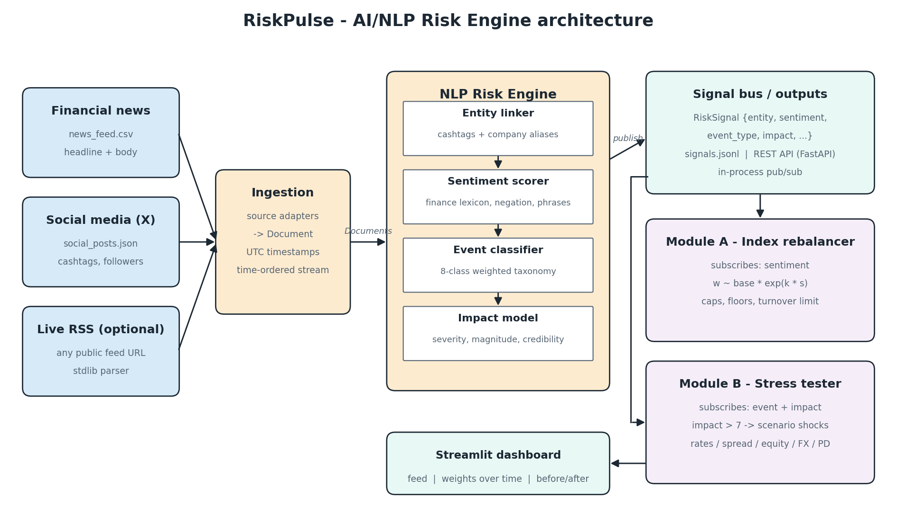
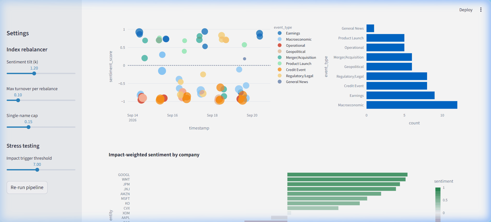

# RiskPulse: AI/NLP Risk Engine - S&P Global & Crisil Campus Hackathon

**Candidate Name:** Madapati Naga Durga Abhinav Sai
**College Email ID:** abhinavsaimadapati@gmail.com
**College / Campus:** VIT-AP University
**Demo Video:** [docs/demo_clip.mp4](docs/demo_clip.mp4) | [docs/demo_clip.gif](docs/demo_clip.gif) (Local Video Clip & Animated Preview)
**Demo Video Link (YouTube):** [YouTube - unlisted]
**Slide Deck:** [docs/presentation.pdf](docs/presentation.pdf) | [docs/presentation.pptx](docs/presentation.pptx)

---

## 1. Project Overview / Problem Statement & Approach

Markets react to text (a downgrade, a missile strike, a hot CPI print) well before
that information turns up in prices, ratings or a daily risk report. The volume is far
beyond what an analyst team can read, and raw text can't be fed into a limit system
or a portfolio model.

RiskPulse is a risk engine that reads unstructured text from several sources and
turns every document into a **structured risk signal**: which company it concerns,
a **sentiment score** (-1 to 1), an **event classification** (Geopolitical,
Macroeconomic, Credit Event, Merger/Acquisition, Product Launch, Earnings,
Regulatory/Legal, Operational) and an **impact score** (1 to 10). Signals go out
three ways: a JSONL file, a REST API and an in-process pub/sub bus.

To show that the signals can actually be used, I built **both** downstream modules:

- **Module A, tactical index rebalancer.** An 18-stock S&P 100 mock index whose
  weights tilt toward names with positive news flow and away from names with
  negative flow. Weight floors, caps and a turnover limit stop one tweet from
  swinging the book.
- **Module B, strategic stress tester.** A synthetic $283m wholesale banking book
  (loans, bonds, swaps, CDS, equity). When a high-impact event arrives
  (impact > 7), the matching scenario (rates, spreads, equity, FX, oil, PD shocks)
  is applied automatically, scaled by the impact score.

## 2. Architecture & Tech Stack



```
news CSV ─┐
social JSON ─┼─► Ingestion ─► NLP Risk Engine ──────────────► signals.jsonl / REST API
live RSS ─┘   (Document)     ├ entity linker                  │
                             ├ sentiment scorer                ├─► Module A  rebalancer
                             ├ event classifier                └─► Module B  stress tester
                             └ impact model                            │
                                                               Streamlit dashboard
```

| Layer | What it does | Where |
|---|---|---|
| Ingestion | Source adapters normalise each feed into a `Document` (UTC timestamp, text, author, reach) | `src/riskengine/ingest.py` |
| Entity linking | Cashtags (`$NVDA`) plus a company alias table (`Nvidia`, `Jensen Huang`); unlinked text goes to `MARKET` | `src/riskengine/nlp.py` |
| Sentiment | Finance-specific lexicon (~250 terms + phrases), negation window, intensifiers/dampeners, emoji, tanh-style squashing to (-1, 1). FinBERT backend is optional | `src/riskengine/nlp.py`, `lexicon.py` |
| Event classification | Weighted keyword voting over an 8-class taxonomy; confidence = winning share of votes | `src/riskengine/nlp.py` |
| Impact | base severity of event class + tone (negative weighted 25% heavier) + magnitude cues (`7%`, `$16 billion`, `25 basis points`) + shock words + breadth + source credibility (followers) | `src/riskengine/nlp.py` |
| Signal bus | `RiskEngine.subscribe()` callbacks, `signals.jsonl`, FastAPI | `src/riskengine/engine.py`, `src/api.py` |
| Module A | `w_i ∝ base_i · exp(k · s_i)` on EWMA sentiment, clipped to [0.4x, 2x] base, 15% single-name cap, 10% max turnover per rebalance | `src/modules/rebalancer.py` |
| Module B | Sensitivity revaluation: duration, spread duration (by rating bucket, sector, region), equity delta, FX delta, loan PD x LGD; scenario chosen by event type and scaled by impact | `src/modules/stress_test.py` |
| Dashboard | Signal feed, weights over time, before/after stress, live "try the engine" box | `src/dashboard.py` |

### Live Interactive Dashboard Preview



**Stack:** Python 3.11+, pandas, FastAPI + uvicorn, Streamlit + Plotly, pytest.
The core engine uses only the standard library.

**Why a lexicon model and not only a transformer?** General-purpose sentiment models
get finance wrong ("liability" is not negative, "crushed it" is not violent, "higher
for longer" is bad news). Every score from the lexicon engine also comes with the
words that drove it, which matters for model-risk review. It runs in milliseconds
with no GPU. A FinBERT backend (`FinBertSentiment`) plugs into the same interface
for teams that want it.

## 3. Dataset Used

All data is in `/data` and is **synthetic**: written by me for this project and
modelled on the style of real financial headlines and posts. It contains no
proprietary or client data.

| File | Contents |
|---|---|
| `news_feed.csv` | 30 news articles (headline + body) over 14-20 Sep 2026, covering every event class |
| `social_posts.json` | 30 X/Twitter-style posts with cashtags, emoji, slang and follower counts; most react to the news items, which tests the cross-source consistency |
| `universe.csv` | 18 S&P 100 constituents with sector, base index weight and name aliases for entity linking |
| `portfolio_transactions.csv` | 20-trade synthetic wholesale banking book: 5 loans, 7 bonds, 5 derivatives, 3 equity baskets, with risk sensitivities, rating, PD and LGD |

**Assumptions**
- Base index weights are illustrative, not actual S&P weights.
- Portfolio sensitivities (durations, deltas) are given per trade, not derived from cash flows.
- Scenario shock sizes are hand-calibrated to be plausible (for example a +100bp
  rates shock, or HY spreads +250bp in a credit contagion). They are not fitted to
  history.
- Social posts are discounted against news, and accounts with more followers are
  discounted less.

**Live data:** `python main.py run --rss <feed-url>` also ingests any public RSS feed,
such as a Yahoo Finance or Google News search feed.

## 4. Quickstart & Installation

Runtime: Python 3.11-3.13, tested on Windows 11.

```bash
git clone https://github.com/abhinavsai2006/vitap-abhinavsai-hackathon.git
cd vitap-abhinavsai-hackathon
pip install -r requirements.txt

python main.py run              # ingest -> signals -> both modules, prints a report
python main.py dashboard        # Streamlit dashboard at http://localhost:8501
```

Other entry points:

```bash
python main.py analyze "Rating agency downgrades Goldman Sachs to junk"   # score one text
python main.py api              # REST API at http://127.0.0.1:8000/docs
python -m pytest                # 24 unit tests
python docs/make_architecture.py && python docs/build_deck.py           # rebuild docs
```

**API endpoints**

| Method | Path | Purpose |
|---|---|---|
| GET | `/signals?entity=NVDA&event_type=Geopolitical&min_impact=7` | filtered signal feed |
| GET | `/signals/summary` | impact-weighted, time-decayed sentiment per company |
| POST | `/analyze` `{"text": "...", "source": "social", "followers": 5000}` | score ad-hoc text |
| GET | `/stress/{event_type}?impact=8.5` | run a stress scenario on the portfolio |
| POST | `/refresh` | re-run the pipeline |

Example signal:

```json
{
  "signal_id": "N013-NVDA", "source": "news", "timestamp": "2026-09-16T12:00:00+00:00",
  "entity": "NVDA", "sentiment_score": -0.877, "sentiment_label": "negative",
  "event_type": "Geopolitical", "event_confidence": 0.79, "impact_score": 8.0,
  "headline": "New export controls target advanced semiconductors",
  "keywords": ["controls", "cut", "export controls", "restrictions", "sanctions", "warned"]
}
```

## 5. Key Results & Domain Impact

**What the prototype produces on the sample data**

- 60 documents became 68 signals (multi-company stories fan out), 19 of them high-impact (> 7).
- News and social posts about the same story agree on sentiment direction in 29 of 30
  pairs. The exception is the OPEC+ cut: the article reads mildly negative
  (airlines slump) while the tweet is positive (oil majors rally), and that story
  really is mixed. Social impact is never higher than news impact for the same story.
- **Module A:** 46 rebalances. AAPL and NVDA are cut by about 4.6pp each after the
  Strait tensions and export-control news, while MSFT, GOOGL and JPM gain 3-4pp on
  M&A, legal-win and earnings news. Turnover stays inside the 10%-per-step limit.
- **Module B:** 10 stress tests triggered automatically. The cooldown merges news
  and social posts about the same story, so it is stressed once. The worst is the
  sovereign downgrade (credit contagion scenario, impact 9.4): **-$28.0m (-9.9%)**,
  mainly from spread widening on HY/distressed bonds and higher expected loss on the
  CRE loan. The ECB cut correctly maps to a *growth-scare* scenario (rates down) and
  not a hawkish one.

**Why it matters**

- **Early warning.** A credit event in the news revalues the book within seconds of
  publication, instead of waiting for the overnight risk run.
- **Explainable.** Every number traces back to the words that produced it, which
  model validation and regulators can audit.
- **One signal, many uses.** The same feed drives trading tilts, scenario analysis
  and (next step) limit monitoring and alerting.
- **Analyst leverage.** One ranked feed replaces dozens of tabs.

**Limitations and next steps:** the lexicon is tuned on a small sample; revaluation is
first-order (no convexity or optionality); scenarios are hand-calibrated. Next I would
fine-tune FinBERT on labelled headlines and ensemble it with the lexicon, calibrate
impact against realised abnormal returns, add a historical scenario library, move
ingestion to streaming (Kafka) and backtest the rebalancer against equal weight.

## Repository layout

```
├── main.py                  CLI entry point
├── src/
│   ├── riskengine/          ingestion, NLP, impact model, engine
│   ├── modules/             rebalancer (A) and stress tester (B)
│   ├── api.py               FastAPI service
│   ├── dashboard.py         Streamlit dashboard
│   └── pipeline.py          end-to-end batch run
├── data/                    all input data (synthetic)
├── output/                  generated signals, weight history, stress results
├── tests/                   pytest suite
└── docs/                    architecture.png, presentation.pdf/.pptx, demo clips, and scripts
```

## License

MIT, see [LICENSE](LICENSE).
